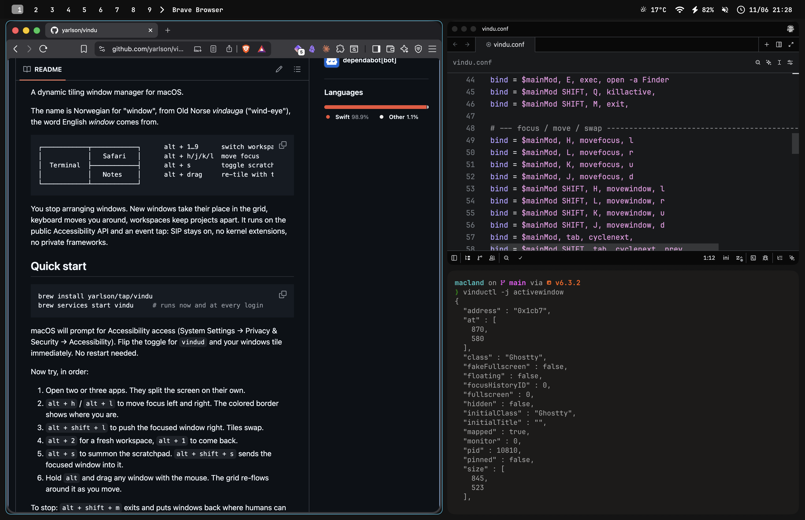

# vindu

[](https://github.com/yarlson/vindu/actions/workflows/ci.yml)

A dynamic tiling window manager for macOS.



The name is Norwegian for "window", from Old Norse _vindauga_ ("wind-eye"),
the word English _window_ comes from.

```
┌────────────┬────────────┐      alt + 1…9      switch workspace
│            │   Safari   │      alt + h/j/k/l  move focus
│  Terminal  ├────────────┤      alt + s        toggle scratchpad
│            │   Notes    │      alt + drag     re-tile with the mouse
└────────────┴────────────┘
```

You stop arranging windows. New windows take their place in the grid,
keyboard moves you around, workspaces keep projects apart. It runs on the
public Accessibility API and an event tap: SIP stays on, no kernel
extensions, no private frameworks.

## Quick start

```sh
brew install yarlson/tap/vindu
brew services start vindu     # runs now and at every login
```

macOS will prompt for Accessibility access (System Settings → Privacy &
Security → Accessibility). Flip the toggle for `vindud` and your windows
tile immediately. No restart needed.

Now try, in order:

1. Open two or three apps. They split the screen on their own.
2. `alt + h` / `alt + l` to move focus left and right. The colored border
   shows where you are.
3. `alt + shift + l` to push the focused window right. Tiles swap.
4. `alt + 2` for a fresh workspace, `alt + 1` to come back.
5. `alt + s` to summon the scratchpad. `alt + shift + s` sends the focused
   window into it.
6. Hold `alt` and drag any window with the mouse. The grid re-flows around
   it as you move.

The first launch shows a keybinding cheat sheet — click it away, bring it
back any time from the vindu icon in the menu bar. The same icon pauses
tiling and quits the daemon, no chords required.

To pause instead of quitting: `alt + shift + p`. Windows move freely until
you press it again and the grid reasserts. To stop: `alt + shift + m` exits
and puts windows back where humans can reach them; `brew services stop
vindu` turns the service off entirely. Logs land in `/tmp/vindu.log`.

## If something looks wrong

- **I need my windows free for a minute.** `alt + shift + p` pauses tiling
  (the menu bar icon works too). Drag things anywhere; press it again and
  the grid reasserts.
- **A window won't tile.** Dialogs and utility panels float on purpose.
  `alt + v` toggles any window between floating and tiled.
- **I dragged a window and it snapped back.** That's the point. The grid
  owns tiled windows. Drag onto another tile to swap places, or `alt + v`
  to float it first.
- **Binds stopped working after I rebuilt.** macOS ties the Accessibility
  grant to the binary identity. Re-toggle `vindud` in System Settings after
  upgrades. `make install` signs ad-hoc so rebuilds of the same tree keep
  the grant.
- **An app's windows vanished.** They're on another workspace. `cmd-tab` to
  the app takes you to its workspace, like it should.
- **I want my config back to defaults.** Delete
  `~/.config/vindu/vindu.conf` and restart `vindud`. It writes a fresh one.

Config errors never crash the daemon. Check `vinductl configerrors` if
something in the file isn't taking effect.

---

Everything below is reference. The defaults are usable without reading it.

## Keymap

The default mod is alt. Cmd works too, vindu swallows bound chords before
apps see them, but cmd carries too much existing muscle memory to be a good
default.

| Keys                              | Action                                       |
| --------------------------------- | -------------------------------------------- |
| `alt + return`                    | open Terminal                                |
| `alt + e`                         | open Finder                                  |
| `alt + h/j/k/l`                   | focus left/down/up/right                     |
| `alt + shift + h/j/k/l`           | move window (swaps tiles)                    |
| `alt + tab` / `alt + shift + tab` | cycle windows on workspace                   |
| `alt + 1…9`                       | switch workspace                             |
| `alt + shift + 1…9`               | send window to workspace and follow          |
| `alt + [` / `alt + ]`             | previous / next workspace                    |
| `alt + s`                         | toggle the `magic` scratchpad                |
| `alt + shift + s`                 | send window to scratchpad                    |
| `alt + v`                         | float / tile                                 |
| `alt + f`                         | maximize, `alt + shift + f` fullscreen       |
| `alt + t`                         | toggle split direction                       |
| `alt + c`                         | center a floating window                     |
| `alt + p`                         | pin a floating window to all workspaces      |
| `alt + m`                         | swap with master                             |
| `alt + shift + p`                 | pause / resume tiling                        |
| `alt + r`                         | resize submap: `h/j/k/l` resize, `esc` exits |
| `alt + drag`                      | move a tile through the grid                 |
| `alt + rightdrag`                 | resize (split ratios when tiled)             |
| `alt + shift + q`                 | close window                                 |
| `alt + shift + m`                 | quit vindu                                   |

Pressing a workspace number twice bounces back to the previous one
(`workspace_back_and_forth`, on by default).

## Configuration

One file: `~/.config/vindu/vindu.conf`. Saves apply immediately, no
restart. Live experiments without touching the file:

```sh
vinductl keyword general:gaps_in 12
vinductl keyword general:layout master
```

```ini
$mainMod = ALT

general {
    gaps_in = 5               # between tiles (each side contributes)
    gaps_out = 12             # screen edges
    border_size = 2
    col.active_border = rgba(33ccffee) rgba(00ff99ee) 45deg
    col.submap_border = rgba(ff5555ee)   # border while a submap is active
    layout = dwindle          # or: master
}

bind = $mainMod, T, exec, open -a kitty
bind = $mainMod, B, workspace, name:browser

bar {
    enabled = false            # same-process workspace/app/status bar
    position = top             # top or bottom
    height = 0                 # 0 = auto; top matches the hidden menu bar
    show_workspaces = true
    show_app = true
    show_indicators = true
    indicators = pause, submap, windows, date, battery, network, keyboard, volume
    # Open-Meteo weather; add weather to indicators after setting lat,lon
    weather_location =
    weather_refresh_minutes = 15
}

# Modal keymaps
bind = $mainMod, R, submap, resize
submap = resize
binde = , L, resizeactive, 30 0     # binde repeats while held
bind = , escape, submap, reset
submap = reset

# Window rules: regex matchers, applied in order
windowrulev2 = float, class:^(Calculator)$
windowrulev2 = workspace 2 silent, class:^(Safari)$, title:GitHub
windowrulev2 = size 800 600, class:^(Finder)$, floating:1
```

Workspace targets: `3`, `+1`, `e+1` (existing only), `previous`, `empty`,
`name:mail`, `special:magic`. Rule effects: `float`, `tile`, `size`,
`move`, `center`, `pin`, `fullscreen`, `workspace N [silent]`,
`monitor <name>`. Matchers: `class`, `title`, `initialclass`,
`initialtitle`, `floating`, `workspace`, `pid`, `address`.

The menu bar icon can be turned off with `misc:menu_bar = false`. The desktop
bar can be enabled live with `vinductl keyword bar:enabled true`; it reserves
screen space and shows workspaces, the focused app/window, and the configured
ordered indicators.

Weather is opt-in and uses Open-Meteo. For Riga:
`vinductl keyword bar:weather_location 56.9496,24.1052`, then include
`weather` in `bar:indicators`.

### Layouts

- **dwindle**: each new window splits the focused tile, orientation follows
  the tile's aspect ratio. `alt + t` transposes a split,
  `vinductl dispatch splitratio exact 1.2` reshapes one.
- **master**: one main area plus a stack. Controlled via `layoutmsg`:
  `swapwithmaster`, `addmaster`, `mfact exact 0.6`, `orientationleft`
  through `orientationcenter`.

Switch any time: `vinductl keyword general:layout master`. Window order
survives the switch.

## Scripting

Two unix sockets. `vinductl` wraps the command socket; anything that can
read a socket can consume the event stream.

```sh
$ vinductl -j activewindow
{
  "address": "0x2a4f",
  "class": "kitty",
  "title": "vim",
  "workspace": { "id": 2, "name": "2" },
  "floating": false,
  ...
}

$ vinductl dispatch movetoworkspace 3      # any bindable action works here
$ vinductl events
workspace>>3
activewindow>>kitty,vim
openwindow>>0x2a51,3,Safari,GitHub
```

- Command socket verbs: `dispatch`, `keyword`, `reload`, `clients`,
  `workspaces`, `monitors`, `activewindow`, `activeworkspace`, `binds`,
  `getoption`, `configerrors`, `cursorpos`, `notify`, `version`. Prefix
  with `j/` (or use `vinductl -j`) for JSON.
- Event socket: push stream of `EVENT>>DATA` lines for workspace changes,
  focus, window lifecycle, fullscreen, submaps, monitors, config reloads,
  tiling pause. Point a status bar (sketchybar etc.) at it instead of
  polling.

## How it works

- `VinduCore`: the config language, binds, rules, both layout engines, gap
  math, focus geometry, workspace registry. Pure logic under `swift test`,
  no GUI dependencies.
- `vindud`: the daemon. Accessibility observers feed window events into the
  layout, a session event tap owns hotkeys and mouse drags, overlay panels draw
  the focus border and optional desktop bar. Hidden workspaces park windows just
  off the visible frame and restore them on switch. That trick is the reason SIP
  can stay on.
- `vinductl`: a thin socket client.

All geometry is top-left-origin global coordinates. AppKit's flipped
coordinates exist only at the border-overlay boundary.

## Limitations

macOS doesn't let anything near its compositor, so there are no animations,
no blur, no per-window opacity, no rounded clipping of other apps' windows.
Not from vindu, not from anything that keeps SIP on. The focus border is an
overlay. Mode-0 fullscreen still shows the menu-bar strip because the
window server owns it. Tiled windows with hard minimum sizes keep their
minimum and the layout allots their tile anyway.

## Migrating from Linux tiling

Hyprland configs largely parse as-is: same dialect, same dispatcher names,
same IPC verbs and event wire format. Compositor-only options like
`animations` and `blur` no-op cleanly. Status-bar scripts written against
the socket conventions work unchanged. Coming from i3/sway, binds, modes
(submaps here), and rules map one-to-one conceptually.

## Development

Running from source instead of brew:

```sh
git clone https://github.com/yarlson/vindu && cd vindu
make build      # debug
make test       # works with Command Line Tools alone, no Xcode needed
make install    # release build, signs, installs to /usr/local/bin
vindud --install-service      # run the dev build now and at every login
vindud --uninstall-service    # undo
```

Two dev-loop gotchas: a rebuilt binary is a new code identity, so re-toggle
`vindud` in Accessibility after `make install` or binds go silently dead.
And don't run the brew service and a dev-build service at the same time —
two window managers fight over the same windows.

Releasing: push a `v*` tag. CI builds the universal (arm64 + x86_64)
tarball, publishes the GitHub release with checksums and provenance, and
bumps the Homebrew formula in `yarlson/homebrew-tap` automatically. The
formula source of truth is `packaging/vindu.rb.tmpl` in this repo.

Layout logic, the config parser, and rule matching live in `VinduCore` and
are covered by plain `swift test` tests. The daemon is the only part that
needs the Accessibility permission, and the only part you can't unit test.

## Roadmap

- Window groups (tabbed containers)
- Inactive-window borders
- Per-workspace layout overrides
- Optional focus-without-raise (private SkyLight, opt-in)
