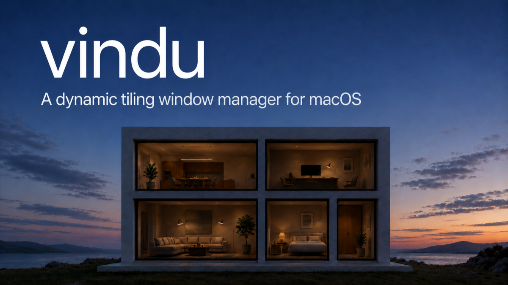

# vindu

[](https://github.com/yarlson/vindu/actions/workflows/ci.yml)

A dynamic tiling window manager for macOS.

[Visit getvindu.app](https://getvindu.app/)



The name is Norwegian for "window", from Old Norse _vindauga_ ("wind-eye"),
the word English _window_ comes from.

```
┌────────────┬────────────┐      alt + 1…9      switch workspace
│            │   Safari   │      alt + h/j/k/l  move focus
│  Terminal  ├────────────┤      alt + s        toggle scratchpad
│            │   Notes    │      alt + drag     re-tile with the mouse
└────────────┴────────────┘
```

New windows take their place in the grid. Keyboard actions move focus and
windows. Workspaces keep projects apart. Vindu uses the Accessibility API and
an event tap, so SIP stays on and it needs no kernel extension. Its focus border
uses optional private WindowServer interfaces; if macOS does not provide them,
tiling continues without the border.

## Quick start

```sh
brew install yarlson/tap/vindu
brew services start vindu
```

The first start writes `~/.config/vindu/vindu.toml`. Vindu validates the file
before it asks for Accessibility access. Enable `vindud` in System Settings →
Privacy & Security → Accessibility, then windows tile without a restart.

Try these actions:

1. Open two or three apps.
2. Press `alt + h` or `alt + l` to move focus.
3. Press `alt + shift + l` to move the focused window right.
4. Press `alt + 2` for another workspace and `alt + 1` to return.
5. Press `alt + s` to show the scratchpad. `alt + shift + s` sends a window to it.
6. Hold `alt` and drag a window through the grid.

The first launch shows a keybinding sheet. The menu bar item can show it again,
pause tiling, open the config, or quit. `alt + shift + p` also pauses tiling.
Service logs are in `~/Library/Logs/vindu/vindud.log`.

## Configuration

Vindu uses strict, versioned TOML 1.1:

```text
~/.config/vindu/vindu.toml
```

The root `schema = 1` field is required. Keys are case-sensitive snake_case.
Unknown keys, duplicate keys, wrong types, invalid references, and out-of-range
values reject the whole candidate. A rejected reload keeps the last valid
snapshot active. On an invalid first start, the control socket and file watcher
stay available, but Vindu does not ask for Accessibility access or manage any
windows.

Use these commands before or after starting the daemon:

```sh
vinductl config check
vinductl config check ./another.toml
vinductl config status
vinductl -j config status
vinductl config reload
```

Saves reload automatically. `config reload` is useful for scripts and explicit
feedback. `config check` never creates or changes a file.

An old `~/.config/vindu/vindu.conf` is not loaded or changed. If it is the only
config present, Vindu stays in configuration-only mode and reports where to
create `vindu.toml`.

The shipped [example configuration](examples/vindu.toml) is the exact first-run
template. A compact configuration looks like this:

```toml
schema = 1

[layout]
kind = "dwindle"
inner_gap = 5
outer_gap = 12

[layout.dwindle]
new_window_fraction = 0.5
new_window_position = "after"

[layout.master]
primary_fraction = 0.55
primary_position = "left"
new_window_position = "stack-end"

[focus]
follows_pointer = false
allow_app_activation = false

[workspaces]
back_and_forth = true

[ui.menu_bar]
enabled = true

[ui.focus_border]
width = 2
fallback_corner_radius = 10
active_colors = ["#33ccffee", "#00ff99ee"]
active_angle = 45
mode_colors = ["#ff5555ee"]

[ui.bar]
enabled = false
position = "top"
height = "auto"
left = ["workspaces", "application"]
center = ["layout"]
right = ["pause", "mode", "windows", "network", "battery", "volume", "date"]

[ui.bar.colors]
background = "#111111cc"
foreground = "#eeeeeeff"
inactive = "#8a8a8aff"
active = "#33ccffee"

[keyboard]
bindings = [
  { chord = "option+return", run = ["/usr/bin/open", "-a", "Terminal"] },
  { chord = "option+h", focus = "left" },
  { chord = "option+shift+h", move = "left" },
  { chord = "option+r", enter_mode = "resize" },
  { mode = "resize", chord = "l", repeat = true, resize = [30, 0] },
  { mode = "resize", chord = "escape", enter_mode = "default" },
]
pointer_bindings = [
  { modifiers = ["option"], button = "left", drag = "move" },
  { modifiers = ["option"], button = "right", drag = "resize" },
]

[startup]
commands = []

[windows]
rules = [
  { match = { bundle_id = "com.apple.systempreferences" }, floating = true, centered = true },
]
```

`run` is an argv array: no shell parses its arguments. The executable must be
absolute or start with `~/`. Use `shell = "..."` only when shell syntax is the
intent; Vindu runs it as `/bin/sh -lc`. A command can add validated values with
`env = { NAME = "value" }`. It cannot replace reserved `VINDU_*` variables.

Window rules run in order when a window appears. `bundle_id` is an exact match;
`app_name` and `title` are regular expressions. Later rules replace earlier
values field by field. Rules can set `floating`, `centered`, `pinned`,
`fullscreen`, `size`, `position`, `workspace`, or `monitor`. A reload does not
move existing windows through the new rule set.

Workspace assignments use a positive workspace id and a display name:

```toml
[[workspaces.assignments]]
id = 2
monitor = "Studio Display"
```

Vindu first tries a case-insensitive exact display name, then a unique partial
match. Missing or ambiguous displays produce a runtime warning and leave the
workspace where it is. Vindu retries after display changes.

## Desktop bar

The optional AppKit bar has three explicit zones. Items in `left` and `right`
stay at their edges. The `center` zone stays at the physical center of the
display, even when the side zones have different widths. Vindu hides the whole
center zone when it would overlap a side or the notch; it never shifts it off
center. Empty zones are valid.

Built-in items are `workspaces`, `application`, `pause`, `mode`, `layout`,
`windows`, `date`, `battery`, `network`, `keyboard`, `volume`, and `weather`.
An item can appear in only one zone.

Weather is opt-in. Add `weather` to a zone and configure coordinates:

```toml
[ui.bar.weather]
latitude = 56.9496
longitude = 24.1052
refresh_minutes = 15
```

This sends the coordinates to Open-Meteo when Vindu refreshes the item.

Script plugins use `plugin:<id>` in any zone and a matching plugin table:

```toml
[ui.bar.plugins.mail]
run = ["~/.config/vindu/bar/mail"]
refresh_seconds = 300
events = ["workspace", "activewindow"]
timeout_ms = 1000
```

Plugins run outside the render path with one active process per plugin, a
timeout, and a small environment. They receive safe home, user, locale, temp,
PATH, socket, and `VINDU_BAR_PLUGIN_*` context values plus their own `env`
entries. They do not inherit unrelated daemon variables or file descriptors.
Plain stdout becomes the item text. JSON can provide `text`, `symbols`, `color`,
and `visible`. Use `vinductl barplugin refresh mail` for a manual refresh.

## Default keymap

| Keys | Action |
| --- | --- |
| `alt + return` | open Terminal |
| `alt + e` | open Finder |
| `alt + h/j/k/l` | focus left/down/up/right |
| `alt + shift + h/j/k/l` | move window |
| `alt + 1…9` | switch workspace |
| `alt + shift + 1…9` | send window and follow |
| `alt + [` / `alt + ]` | previous / next workspace |
| `alt + s` | toggle the `magic` scratchpad |
| `alt + shift + s` | send window to the scratchpad |
| `alt + v` | float / tile |
| `alt + f` | maximize |
| `alt + shift + f` | fullscreen |
| `alt + t` | toggle split direction |
| `alt + c` | float and center a window |
| `alt + p` | pin a floating window |
| `alt + m` | swap with the primary window |
| `alt + shift + p` | pause / resume tiling |
| `alt + r` | resize mode; `h/j/k/l` resize, `escape` exits |
| `alt + drag` | move a window through the grid |
| `alt + right-drag` | resize a window or split |
| `alt + shift + q` | close window |
| `alt + shift + m` | quit Vindu |

## Scripting

`vinductl` talks to a request socket. `vinductl events` reads a separate event
stream. Existing runtime commands include `dispatch`, `clients`, `workspaces`,
`monitors`, `activewindow`, `activeworkspace`, `binds`, `cursorpos`, `notify`,
`version`, the `config` commands, and bar plugin refresh.

```sh
vinductl -j activewindow
vinductl dispatch movetoworkspace 3
vinductl events
```

Information commands support JSON with `-j`. Event lines use `EVENT>>DATA` and
cover workspace, focus, window, fullscreen, mode, monitor, config reload, and
pause changes. Runtime dispatcher names remain separate from the configuration
schema.

## If something looks wrong

- `vinductl config status` shows the selected path, daemon state, active schema,
  rejected diagnostics, and runtime warnings.
- `vinductl config check` validates the file without contacting the daemon.
- A window that does not tile may be a dialog or utility panel. `alt + v`
  changes the focused window between floating and tiled.
- If binds stop after a rebuild, re-enable `vindud` under Accessibility. macOS
  ties the grant to the binary identity.
- To restore defaults, remove `~/.config/vindu/vindu.toml` while no legacy
  `vindu.conf` remains, then restart Vindu.
- Stop the service with `brew services stop vindu`.

## Development

```sh
git clone https://github.com/yarlson/vindu
cd vindu
make build
make test
make install
vindud --install-service
vindud --config ./vindu.toml --install-service
vindud --uninstall-service
```

The default service does not store a config argument, so it keeps the standard
native selection rules. A service installed with an explicit `--config` keeps
that resolved path. Reinstall an existing service after upgrading from a build
that stored the old default path.

`VinduCore` owns the strict compiler, immutable configuration types, actions,
layouts, workspace registry, rule matching, and public IPC models.
`VinduDaemonSupport` owns testable file, socket, watcher, plugin, weather, and
LaunchAgent boundaries. `vindud` owns AppKit, Accessibility, input, monitor, and
runtime orchestration. `VinduBorderEngine` contains all private WindowServer
calls and disables only the border when that boundary fails.

Do not run a Homebrew service and a development service at the same time. Two
window managers will fight over the same windows. Live Accessibility, AppKit,
notch, and private border behavior still require a real logged-in macOS session;
the repository tests do not simulate those platform boundaries.
